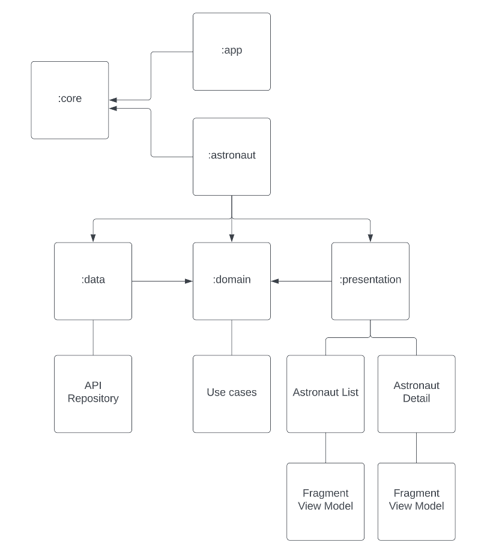
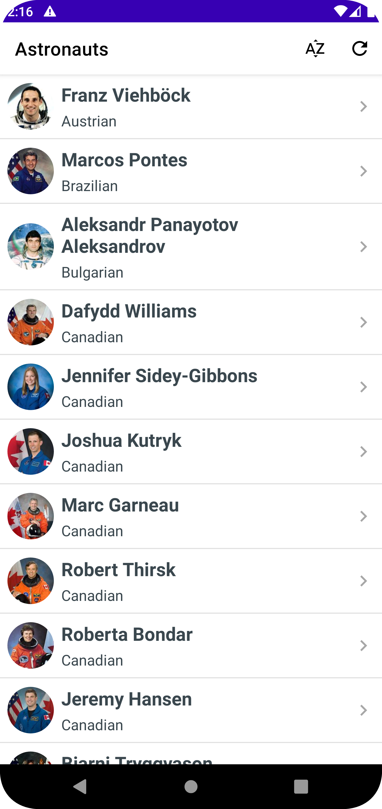
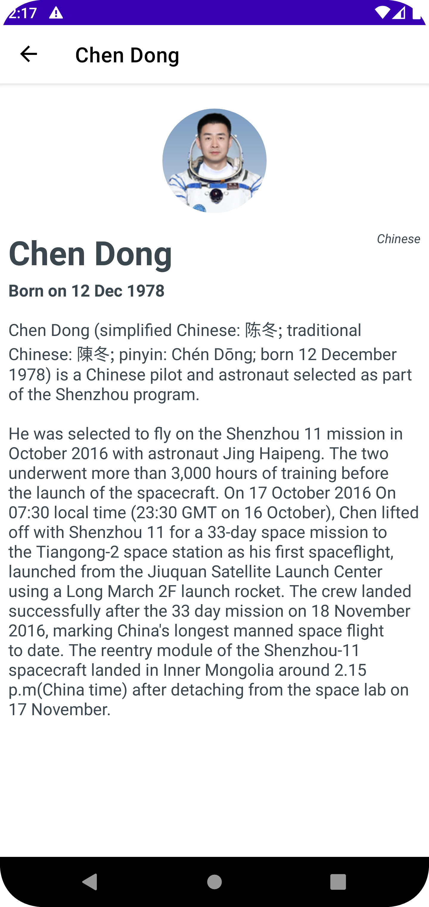

# SpaceLaunch
SpaceLaunch is an Android app to display a list of astronauts and their details. The user can sort the list by name. 

## Architecture

`MVVM - Model - ViewModel - View` is the pattern used for this app. MVVM with Clean architecure provides a clear separation of concern. I have used `Feature-level multi module architecture`.

`:app` - this module contains the `MainActivity` which hosts a Navigation controller.

`:core` - this module contains common code such as extensions, utility classes, enums.

`:astronaut` - this is a feature level module which has 3 other modules - *data, domain and presentation*.

`:astonaut_data` - this module contains the repository and api integration to fetch from Spacelaunch api.

`:astronaut_domain` - this module contains use cases and repository interfaces.

`:astronaut_presenation` - this module is responsible for hosting fragments, viewmodels.

## Testing

`:astronaut_data` has unit tests for repository
`:astronaut_domain` has unit tests for usecases

## Libraries used

1. *Material Design Components*
2. *Retrofit and okHttp* - Network calls
3. *Shimmer* - Loading animation
4. *Glide* - Image loading
5. *Dagger Hilt* - Dependency injection

## Assumptions

* This app will run on devices with minimum SDK version \>= 23
* I have used Android Studio Dolphin | 2021.3.1 Patch 1

## Screenshots

   
